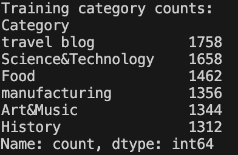
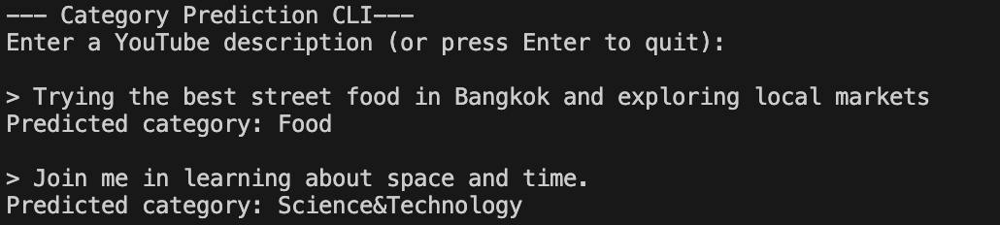

# YouTube Description Category Classifier

## Overview
This project implements an **end-to-end Natural Language Processing (NLP) and Machine Learning pipeline** to predict the category of a YouTube video based solely on its description text.

The system takes in raw, user generated text to which it cleans and preprocesses it, converts it into numerical features using TF-IDF, trains a supervised machine learning classifier, evaluates its performance on unseen data, and supports real time category prediction through a command line interface (CLI).

----

```bash
## File Structure
youtube-description-category-classifier/
├── data/
│   ├── youtube_video_dataset.csv
│   └── cleaned_dataset.csv
├── images/
│   └── example_output.png
│   └── precision_recall_f1.png
│   └── training_category_counts.png
├── src/
│   ├── clean_data.py
│   ├── clean_data.py
│   ├── analyze_text_lengths.py
│   ├── text_stats.py
│   ├── tfidf_analysis.py
│   └── category_classifier.py
└── README.md
```

----

## Getting Started
### Dependencies
Before running this project, ensure the following prerequisites are installed:
- Operating System: MacOS, Windows 10+, Linux
- Python: Python 3.9 or newer
- Python Libraries: pandas, scikit-learn, numpy

Install the required libraries using:

```
pip install pandas scikit-learn numpy
```

### Installation
Download or clone the repository
```
git clone https://github.com/leah-arrieta/youtube-description-category-classifier.git
cd youtube-description-category-classifier
```

If starting from the raw Kaggle dataset, run:

```
python src/clean_data.py
```

### Execution
To run the Category Classifier
1. Navigate to the project root directory.
2. Run the classifier script.

```
python src/category_classifier.py
```

This is load the cleaned dataset, train a TF-IDF and Logistic Regression model, evaluate performace on test data, then prompt the user.

3. Enter a description when prompted.

```
Enter a YouTube description:
> Exploring street food markets in Bangkok
```

4. View the predicted category
```
Predicted category: Food
```

----

## Dataset
- Real world dataset of YouTube videos
- Each record contains:
  - Video description (text)
  - Video category (label)
- The dataset reflects authentic and noisy user generated content which is perfect to mimic real user data.

----

## Data Cleaning & Preprocessing
To ensure high quality input for NLP and machine learning I:
- Removed rows with missing descriptions or categories
- Stripped URLs to reduce noise
- Removed emojis to focus on textual semantics
- Normalized whitespace and handled non-string values safely
- Truncated excessively long descriptions to control outliers (1024 chars)

These steps ensured that every training example contained clean and meaningful text.

----

## NLP & Feature Engineering
### Tokenization
- Converted text to lowercase
- Split descriptions into word tokens

### Stopword Handling
- Removed common English stopwords during analysis to reduce noise
- Preserved meaningful vocabulary for learning

### TF-IDF (Term Frequency–Inverse Document Frequency)
- Converted text descriptions into numerical feature vectors
- Analyzed:
  - Word importance within a description
  - Word rarity across the dataset
- Provided an interpretable bridge between raw text and machine learning models

### Category Level Analysis
- Grouped descriptions by category
- Analyzed distinctive vocabulary per category
- Verified that categories show meaningful linguistic differences

----

## Supervised Machine Learning
### Train/Test Split
- Split data into 80% training, 20% testing
- Used stratified sampling to preserve category balance

### Model
- **Logistic Regression Classifier**
- Trained on TF-IDF feature vectors
- Chosen for:
  - Interpretability
  - Efficiency
  - Strong performance on text classification tasks

### Performance
- Achieved approximately **90% accuracy** on unseen test data
- Demonstrates strong generalization rather than memorization

----

## Evaluation
The model was evaluated using:
- **Accuracy**: overall correctness on the test set
- **Precision**: reliability of category predictions
- **Recall**: ability to identify all examples of each category
- **F1-score**: balance between precision and recall

A full classification report was generated to analyze per category performance.



----

## Practical Usage (CLI Inference)
The project includes a **command line interface** that allows users to classify new descriptions in real time.

### Example
```text
Enter a YouTube description:
> Trying the best street food in Bangkok and exploring local markets

Predicted category: Food
```


----

## Reflection
This project was my first full data science project so it required learning many new concepts from the ground up. I worked through the pipeline from cleaning a real world text dataset to building, evaluating, and deploying a machine learning classifier.

### Key Takeaways
- Gained hands on experience with text preprocessing
    - Handling missing values, removing noise (URLs and emojis), tokenization, and stopword removal
- Learned how TF-IDF transforms text into meaningful numerical features and why it improves category specific word importance
- Built and evaluated a supervised machine learning model using logistic regression, achieving ~90% accuracy
- Implemented a CLI based inference workflow for classifying unseen user input

### Challenges
The most challenging part of this project was understanding and implementing TF-IDF, specifically how inverse document frequency affects feature weighting and why vectorizers must be fit only on training data. Debugging preprocessing issues and unexpected data types also reinforced the importance of careful data validation.

### Practical Value
This classifier demonstrates a realistic application of automatically predicting video categories from text descriptions.

### Future Improvements
Possible extensions include model persistence, visualizations, or experimenting with more advanced models.

Overall, this project provided a strong foundation in applied NLP and machine learning and increased my confidence in working with real world data.

----

## Resources
The following resources were used to support learning, implementation, and understand concepts throughout this project:

- **Dataset**
  - YouTube Video Dataset (Kaggle):  
    https://www.kaggle.com/datasets/rahulanand0070/youtubevideodataset

- **Machine Learning & NLP Concepts**
  - Understanding Logistic Regression (GeeksforGeeks):  
    https://www.geeksforgeeks.org/machine-learning/understanding-logistic-regression/
  - Getting Started with Classification (GeeksforGeeks):  
    https://www.geeksforgeeks.org/machine-learning/getting-started-with-classification/
  - Understanding TF-IDF (Term Frequency–Inverse Document Frequency) (GeeksforGeeks):  
    https://www.geeksforgeeks.org/machine-learning/understanding-tf-idf-term-frequency-inverse-document-frequency/

- **Python & Libraries**
  - Pandas Documentation and Tutorials (W3Schools):  
    https://www.w3schools.com/python/pandas/default.asp

----

## Author
Contributors names and contact info:

Leah Arrieta
leah.arrieta00@gmail.com